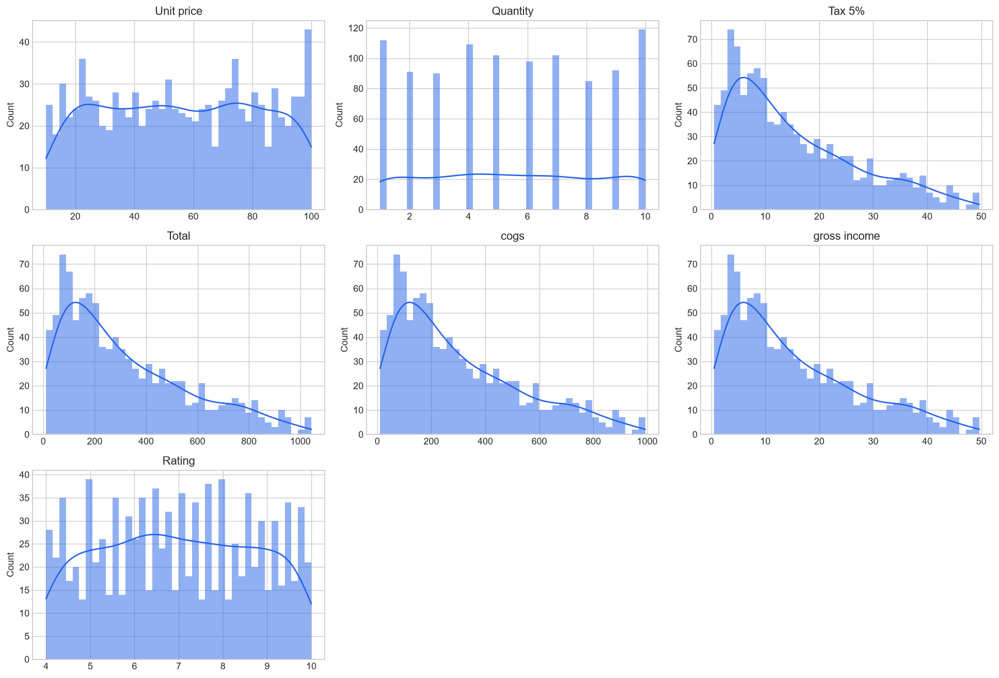
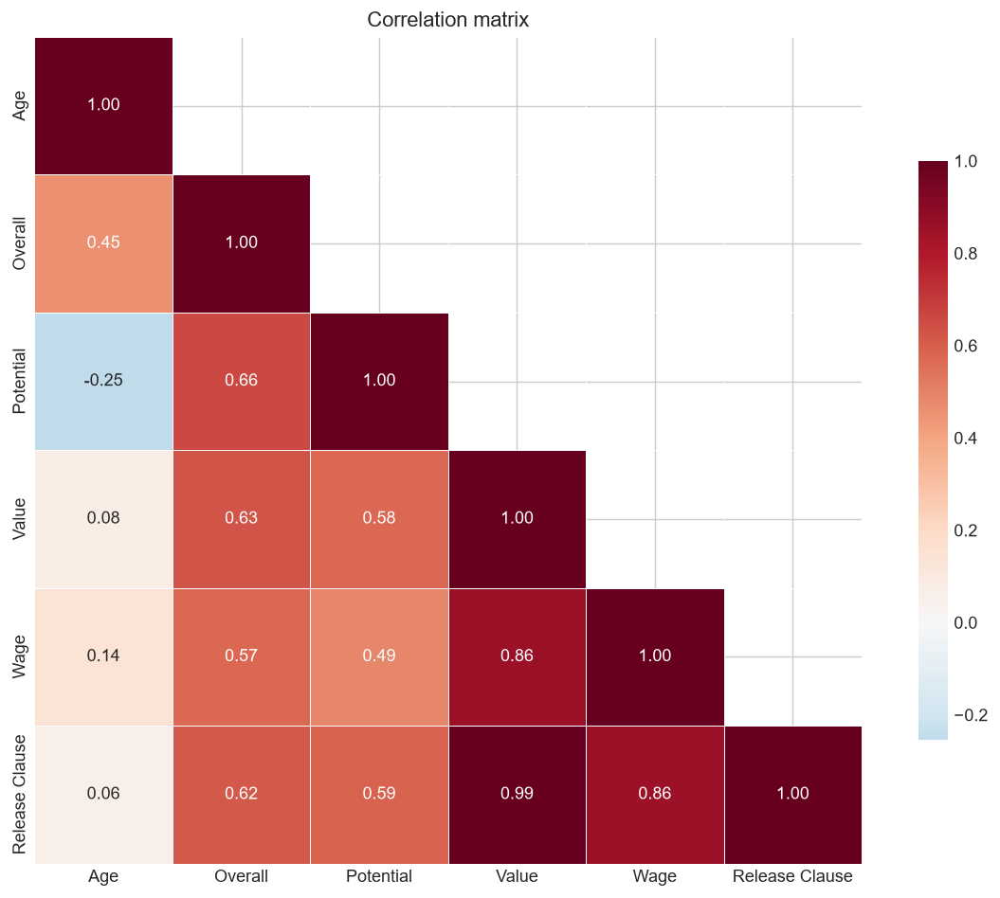
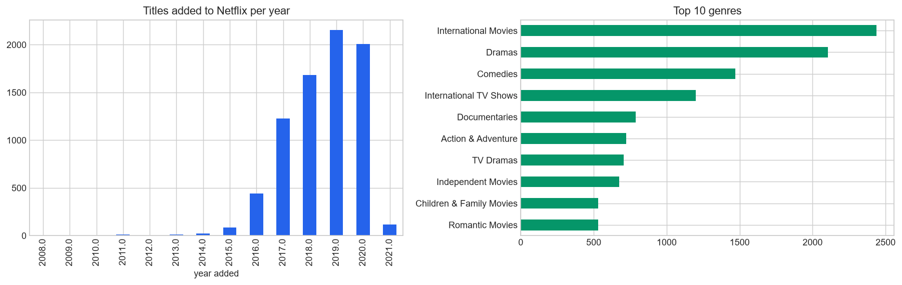

# EDA Portfolio

Three exploratory analyses on public datasets — supermarket transactions, FIFA 19 player
attributes, and the Netflix catalogue — sharing one tested profiling library rather than
three copies of the same plotting code.

<p align="left">
  
  
  
  
</p>

---

## Why one repository

These began as three separate notebooks that each re-implemented the same
`Histogram(df, col)`, `Boxplot(df, col)` and `BarPlot(df, col)` helpers by copy-paste.
That duplication was not just untidy — **it hid a real bug**. The Netflix notebook's
numeric-plotting cell still carried the FIFA column list:

```python
# in the Netflix notebook, operating on Netflix data:
numerical_cols = ['Age', 'Overall', 'Potential', 'Value', 'Wage',
                  'Height', 'Weight', 'Release Clause']
for col in numerical_cols:
    Histogram(df, col)
```

None of those columns exist in the Netflix data. The cell was dead.

In [`src/edatools/`](src/edatools/) column lists are **derived from dtypes**, never
pasted, which makes that class of error impossible. A second copy-paste bug is fixed the
same way — see [Multi-value columns](#multi-value-columns-the-copy-not-a-copy-bug) below.

## Findings

Every number below is computed by [`scripts/run_analysis.py`](scripts/run_analysis.py)
and stored in [`results/findings.json`](results/findings.json).

### Supermarket sales — 1,000 transactions, 3 branches

**The accounting identities hold exactly.** The original notebook hypothesised
`Total = COGS + Gross income` and noted that gross income appeared equal to the 5% tax.
Both are now verified rather than assumed — maximum absolute residual **0.000000** on
both. The dataset is internally consistent and fully synthetic in its arithmetic.

**The gender/product-line difference is not statistically significant.** The notebook
showed a grouped countplot of product line by gender and read a pattern into it. A
chi-squared test of independence says otherwise:

| Statistic | Value |
|---|---|
| χ² | 5.74 |
| df | 5 |
| **p-value** | **0.332** |

At p = 0.33 the apparent differences are what you would expect from random variation in
1,000 rows. **This is the most useful thing in the supermarket study**: the bar chart
looked meaningful and wasn't. A visual difference is a hypothesis, not a finding.

**Branches are nearly indistinguishable.** Mean customer ratings: A 7.03, B 6.82,
C 7.07 — a spread of 0.25 on a 10-point scale. Revenue is similarly flat across the six
product lines (Food and beverages leads at 56,145; Health and beauty trails at 49,194 —
a 14% spread). Payment methods split almost evenly: Ewallet 34.5%, Cash 34.4%,
Credit card 31.1%.

No missing values, no duplicates.



### FIFA 19 — 18,207 players, 89 attributes

**Player value is exponential in rating, not linear.** This is the headline result:

| Relationship | Pearson r |
|---|---:|
| Overall → Value | 0.632 |
| Overall → **log(Value)** | **0.938** |

A linear correlation of 0.63 suggests a moderate relationship. Log-transforming the
target reveals it is nearly deterministic. Going from 70 to 80 Overall does not add a
fixed number of euros — it multiplies value. Any model of player value should be fitted
on log(value); a linear fit would be badly misspecified and would treat the superstar
tail as outliers rather than as the structure it is.

**Value is extraordinarily concentrated.** Skew of **7.07**; mean €2.41M against a median
of €675K. The **top 1% of players hold 17.8% of total squad value**.

**Growth headroom collapses with age** — correlation between age and
(Potential − Overall) is **−0.864**, one of the strongest relationships in the dataset.
Scouting value is almost entirely an age story.

**Left-footed players rate marginally higher**: mean Overall 66.80 vs 66.08 for
right-footed, despite being only 23.2% of the population. A 0.72-point gap on a
100-point scale — real in this sample, but small enough that it needs a significance
test before anyone should believe it.



### Netflix catalogue — 7,787 titles

**Two-thirds of TV shows never get a second season.** Of 2,410 series, **66.7% have
exactly one season.** For a catalogue-strategy question that is the standout number.

**The catalogue is a recent-acquisition machine.** Titles added per year: 88 (2015) →
443 (2016) → 1,225 (2017) → 1,685 (2018) → **2,153 (2019)** → 2,009 (2020). And the
median age of content *at the moment it was added* has been **1 year** every year since
2016 — Netflix is overwhelmingly buying new releases, not back-catalogue.

**Content skews international.** "International Movies" is the single largest genre
(2,437 titles), ahead of Dramas (2,106) and Comedies (1,471). The US leads by country
(3,297) but India is second (990) — ahead of the UK (723).

Movies average 99.3 minutes (median 98).

**On the malformed `rating` column:** the original notebook found runtime strings
(`"74 min"`) filed under `rating` and correctly converted them to NaN. **This mirror of
the dataset contains 0 such rows** — the bug is present in the later 8,807-row Kaggle
release, not the 7,787-row snapshot used here. The cleaning step is retained and
reported (`ratings_containing_runtime: 0`) because it is correct defensive handling, but
it is not doing work on this version. Claiming otherwise would be reporting a fix for a
problem that isn't there.



## Multi-value columns: the "copy" that wasn't a copy

`listed_in`, `cast`, and `country` hold comma-delimited lists. The notebook exploded them
like this:

```python
df_netflix_exploded = df_netflix          # <- a reference, not a copy
df_netflix_exploded['listed_in'] = df_netflix_exploded['listed_in'].apply(...)
df_genres = df_netflix_exploded.explode('listed_in')
```

`df_netflix_exploded = df_netflix` binds a second name to the *same* dataframe. Every
"exploded copy" therefore overwrote the original column in place, and this was done three
times in sequence for genres, cast, and country — so each later cell operated on data the
previous one had already mutated.

`explode_multi_value()` returns a new `Series` and never touches the source frame. A test
asserts the input is unmodified.

## Quickstart

```bash
git clone https://github.com/yasmine-ali101/eda-portfolio.git
cd eda-portfolio

python -m venv .venv && source .venv/bin/activate   # Windows: .venv\Scripts\activate
pip install -r requirements.txt

python scripts/download_data.py    # fetches the 3 public datasets (~12 MB)
python scripts/run_analysis.py     # regenerates every figure and findings.json
pytest                             # 16 tests
```

## Project structure

```
src/edatools/
├── profiling.py       # dtype-derived column selection, missing/outlier reports,
│                      # safe multi-value explosion
└── plots.py           # histogram/boxplot/categorical grids, correlation, missingness
scripts/
├── download_data.py   # fetch the three public datasets
└── run_analysis.py    # run all three studies -> results/
notebooks/             # the original three notebooks, preserved
results/               # findings.json + figures per study (regenerated)
tests/                 # 16 tests over the shared library
```

## Data

Three public datasets, downloaded rather than committed:

| Dataset | Rows | Source |
|---|---:|---|
| Supermarket sales | 1,000 | Kaggle `aungpyaeap/supermarket-sales` |
| FIFA 19 players | 18,207 | Kaggle FIFA 19 complete player dataset |
| Netflix titles | 7,787 | Kaggle `shivamb/netflix-shows` (via TidyTuesday) |

`scripts/download_data.py` pulls each from a stable raw mirror. If a mirror moves, the
script names the Kaggle source so the file can be dropped into `data/` manually.

## Limitations

- **EDA, not inference.** Only the supermarket gender/product-line question gets a
  significance test. The FIFA preferred-foot gap and the Netflix genre trends are
  described, not tested — they should be treated as hypotheses.
- **The Netflix snapshot is from April 2021** and is not the largest available release;
  row counts differ from analyses using the 8,807-row version.
- **`duration` parsing assumes the English "min"/"Season" strings** used throughout this
  dataset.
- **FIFA money columns are parsed from `€110.5M` strings**, so anything in an unexpected
  format becomes NaN rather than raising.

## Notes on scope

Consolidated from three separate coursework notebooks. The analyses are the original
work; the shared library, statistical testing, bug fixes, figures, and tests were added
here.

## License

[MIT](LICENSE)
