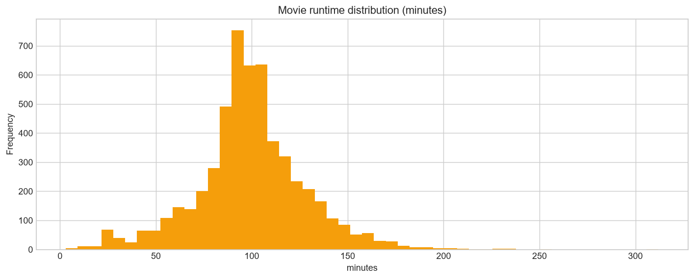

# Netflix Catalogue Analysis

Exploratory analysis of 7,787 Netflix titles, built on a small tested profiling library
rather than the copy-pasted plotting helpers the original notebook used.

<p align="left">
  
  
  
</p>

---

## Findings

Every number below is computed by [`scripts/run_analysis.py`](scripts/run_analysis.py) and
stored in [`results/findings.json`](results/findings.json).

### Two thirds of Netflix TV shows never get a second season

Of 2,410 series in the catalogue, **66.7% have exactly one season.** For a catalogue
strategy question that is the standout number, and it is invisible until `duration` is
split, because that column mixes two incompatible units.

### The catalogue is a recent-acquisition machine

Titles added per year:

| Year | 2015 | 2016 | 2017 | 2018 | 2019 | 2020 |
|---|---:|---:|---:|---:|---:|---:|
| Titles added | 88 | 443 | 1,225 | 1,685 | **2,153** | 2,009 |

More striking is the **median age of content at the moment it was added**, which has been
**1 year, every year since 2016**. Netflix is overwhelmingly buying new releases rather
than back catalogue.


### Content skews international

"International Movies" is the single largest genre at 2,437 titles, ahead of Dramas (2,106)
and Comedies (1,471). The United States leads by country with 3,297 titles, but India is
second at 990, ahead of the United Kingdom at 723.

Movies average 99.3 minutes, median 98.



### On the malformed `rating` column

The original notebook found runtime strings such as `"74 min"` filed under `rating` and
correctly converted them to NaN.

**This snapshot of the dataset contains 0 such rows.** The bug is present in the later
8,807-row Kaggle release, not the 7,787-row April 2021 snapshot used here. The cleaning
step is kept and its count reported (`ratings_containing_runtime: 0`), because it is
correct defensive handling, but it is not doing any work on this version. Reporting it as
a fix would be claiming credit for solving a problem that is not there.

## Two bugs the original notebook carried

The analysis began as one of three notebooks that each re-implemented the same
`Histogram(df, col)`, `Boxplot(df, col)` and `BarPlot(df, col)` helpers by copy-paste. That
duplication was not just untidy, it actively hid defects.

### 1. A dead plotting cell

The Netflix notebook's numeric-plotting cell still carried the column list from the FIFA
notebook it was copied from:

```python
# in the Netflix notebook, operating on Netflix data:
numerical_cols = ['Age', 'Overall', 'Potential', 'Value', 'Wage',
                  'Height', 'Weight', 'Release Clause']
for col in numerical_cols:
    Histogram(df, col)
```

Not one of those columns exists in the Netflix data. The cell produced nothing.

In [`src/edatools/`](src/edatools/) column lists are **derived from dtypes**, never pasted,
which makes that class of error impossible.

### 2. A "copy" that was not a copy

`listed_in`, `cast`, and `country` hold comma-delimited lists. The notebook exploded them
like this:

```python
df_netflix_exploded = df_netflix          # a reference, not a copy
df_netflix_exploded['listed_in'] = df_netflix_exploded['listed_in'].apply(...)
df_genres = df_netflix_exploded.explode('listed_in')
```

`df_netflix_exploded = df_netflix` binds a second name to the *same* dataframe, so every
"exploded copy" overwrote the original column in place. This was done three times in
sequence for genres, cast, and country, meaning each later cell operated on data the
previous one had already mutated.

`explode_multi_value()` returns a new `Series` and never touches the source frame.
[A test asserts the input is unmodified](tests/test_profiling.py).

## Quickstart

```bash
git clone https://github.com/yasmine-ali101/netflix-catalogue-analysis.git
cd netflix-catalogue-analysis

python -m venv .venv && source .venv/bin/activate   # Windows: .venv\Scripts\activate
pip install -r requirements.txt

python scripts/download_data.py    # fetches the dataset, about 3 MB
python scripts/run_analysis.py     # regenerates every figure and findings.json
pytest                             # 16 tests
```

## Project structure

```
src/edatools/
├── profiling.py       # dtype-derived column selection, missing/outlier reports,
│                      # safe multi-value explosion
└── plots.py           # histogram/boxplot/categorical grids, correlation, missingness
scripts/
├── download_data.py   # fetch the public dataset
└── run_analysis.py    # run the analysis, write results/
notebooks/             # the original notebook, preserved with its outputs
results/               # findings.json and figures (regenerated)
tests/                 # 16 tests over the shared library
```

The `edatools` library is deliberately dataset-agnostic. It was extracted from three
separate studies and is written against dtypes rather than named columns, so it applies to
any tabular dataset.

## Data

| Dataset | Rows | Source |
|---|---:|---|
| Netflix titles | 7,787 | Kaggle `shivamb/netflix-shows`, via TidyTuesday |

`scripts/download_data.py` pulls it from a stable raw mirror. If the mirror moves, the
script names the Kaggle source so the file can be dropped into `data/` manually.

## Limitations

- **Exploratory, not inferential.** The genre and country trends are described rather than
  significance-tested, and should be treated as hypotheses.
- **The snapshot is from April 2021** and is not the largest available release, so row
  counts differ from analyses using the 8,807-row version.
- **`duration` parsing assumes the English "min" and "Season" strings** used throughout this
  dataset.
- **Single-season share counts what is in the catalogue**, which is not quite the same as a
  renewal rate: a show could have been renewed but only have one season listed at snapshot
  time.

## Notes on scope

The analysis is original coursework. The shared library, bug fixes, figures, and test suite
were added here.

## License

[MIT](LICENSE)
